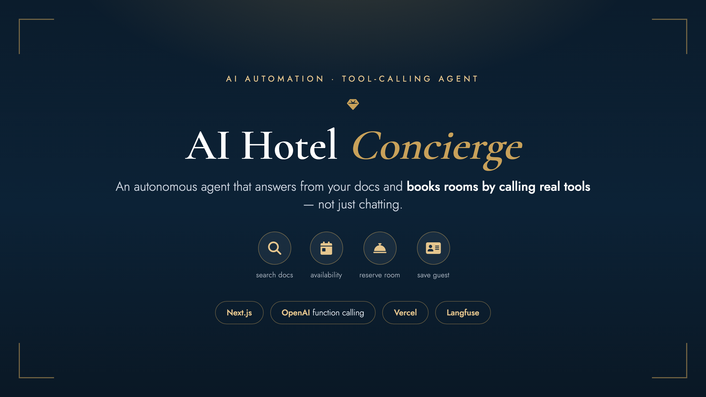
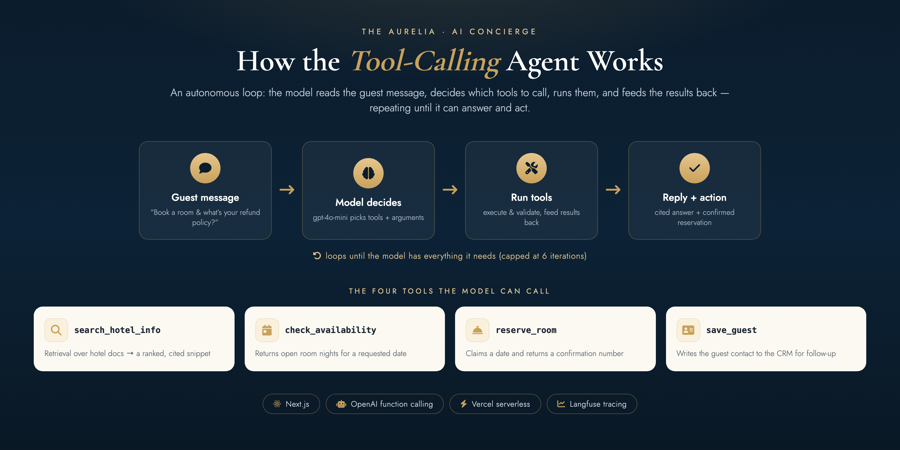
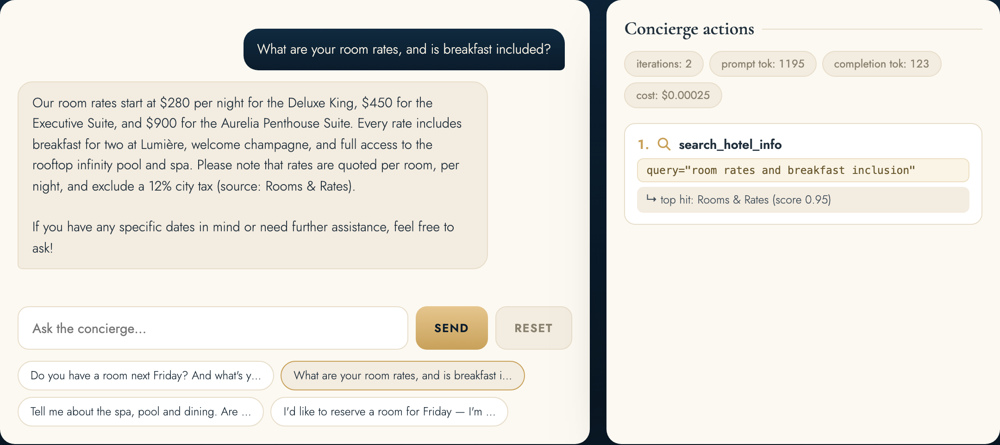
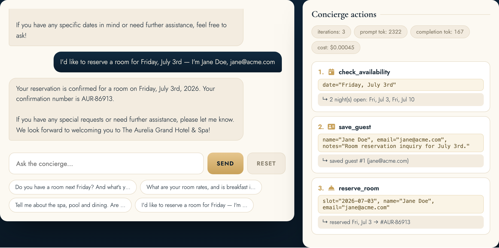

# AI Hotel Concierge — Tool-Calling Agent



An autonomous AI agent that **reads a guest message and takes action by calling
tools** — not just chatting. It answers questions from a hotel's knowledge base
(with citations) *and* checks availability, reserves rooms, and saves guests to a
CRM, deciding for itself which tools to call. Built as a **Next.js app with the
agent loop in a serverless API route**, deployed on Vercel.

**▶ Live app:** https://ai-booking-agent-web.vercel.app

> **Example**
> **Guest:** "Do you have a room next Friday? Also, what's your cancellation policy?"
> → `search_hotel_info` + `check_availability` → cites the 48-hour policy, lists open nights, asks for name + email.
> **Guest:** "I'd like Friday July 3rd — I'm Jane Doe, jane@acme.com"
> → `reserve_room` + `save_guest` → "Your room is reserved for Fri, Jul 3 (reservation #AUR-86913)."

## What it demonstrates

Tool calling · autonomous agents · function-calling JSON schemas · RAG-as-a-tool ·
an agent loop with an iteration cap + argument validation · full-stack TypeScript ·
serverless deploy · Langfuse tracing.

## How it works



The model decides which tool(s) to call, the app runs them, feeds the results
back, and the loop repeats until the agent can both **answer and act** (capped at
6 iterations). It lives in [`lib/agent.ts`](lib/agent.ts), called from the API
route [`app/api/chat/route.ts`](app/api/chat/route.ts). Several tools can be
requested in one turn; each result is fed back as a `tool` message.

## The 4 tools

| Tool | What it does |
| --- | --- |
| `search_hotel_info(query)` | Retrieval over the hotel docs → a ranked, **cited** snippet ([`lib/kb.ts`](lib/kb.ts)) |
| `check_availability(date)` | Returns open room nights, optionally filtered to a weekday |
| `reserve_room(slot, name, email)` | Claims a date + returns a confirmation number |
| `save_guest(name, email, notes)` | Writes the contact to the CRM |

Schemas + dispatch live in [`lib/tools.ts`](lib/tools.ts).

## A cited answer + a confirmed booking

The right-hand panel shows every tool the agent chose to call, with token usage
and cost per message.




## Run locally

```bash
npm install
npm run dev          # http://localhost:3000
```

It runs with no API key in a deterministic offline mode (the same agent loop,
with an offline brain choosing the tool calls). For real tool-calling, add a key:

```bash
cp .env.example .env.local
# OPENAI_API_KEY=sk-...                  -> real gpt-4o-mini tool-calling
# LANGFUSE_PUBLIC_KEY / LANGFUSE_SECRET  -> optional, traces every tool call
```

## Deploy to Vercel

A standard Next.js app — push to GitHub and import in Vercel, or:

```bash
vercel --prod
```

Then add `OPENAI_API_KEY` (and optionally the `LANGFUSE_*` keys) in
**Vercel → Project → Settings → Environment Variables**.

## Architecture

```
app/
├── page.tsx              # React chat UI + tool-trace panel + reservations tab
├── layout.tsx
├── globals.css
└── api/chat/route.ts     # POST -> runAgent(); GET -> {mock, langfuse, model}
lib/
├── agent.ts              # the tool-calling loop
├── llm.ts                # OpenAI client / optional Langfuse / offline brain
├── tools.ts              # 4 tool fns + JSON schemas + dispatch
├── kb.ts                 # retrieval (concept-coverage scoring, cited)
└── db.ts                 # in-memory calendar + CRM (ephemeral on serverless)
data/kb.ts                # the hotel docs the agent answers from
```

**Note on state:** the calendar/CRM is in-memory, so on Vercel's serverless
runtime it resets on cold start. The UI rebuilds the reservations view from the
tool-call trace, so it stays coherent. Swap [`lib/db.ts`](lib/db.ts) for a real
database + calendar API (Google Calendar, a PMS, HubSpot) and the tool contracts
don't change.

---

*The Aurelia Grand Hotel is a sample business used to showcase the agent. The
agent, tools, retrieval, and deployment are all real.*
